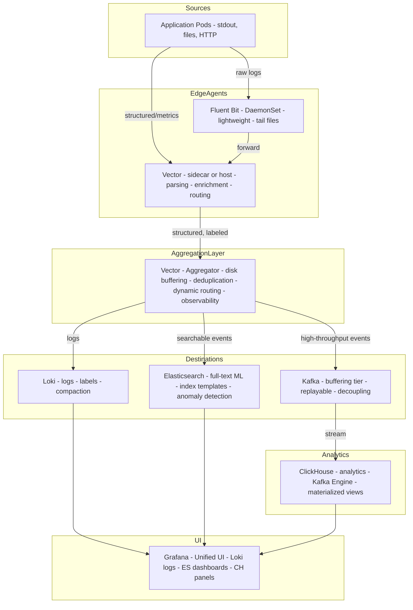

```mermaid
flowchart TD
    subgraph Sources
        A[Application Pods - stdout, files, HTTP]
    end

    subgraph EdgeAgents
        B[Fluent Bit - DaemonSet - lightweight - tail files]
        C[Vector - sidecar or host - parsing - enrichment - routing]
    end

    subgraph AggregationLayer
        D[Vector - Aggregator - disk buffering - deduplication - dynamic routing - observability]
    end

    subgraph Destinations
        E[Loki - logs - labels - compaction]
        F[Elasticsearch - full-text ML - index templates - anomaly detection]
        G[Kafka - buffering tier - replayable - decoupling]
    end

    subgraph Analytics
        H[ClickHouse - analytics - Kafka Engine - materialized views]
    end

    subgraph UI
        I[Grafana - Unified UI - Loki logs - ES dashboards - CH panels]
    end

    %% Connections
    A -->|raw logs| B
    A -->|structured/metrics| C
    B -->|forward| C
    C -->|structured, labeled| D

    D -->|logs| E
    D -->|searchable events| F
    D -->|high-throughput events| G

    G -->|stream| H

    E --> I
    F --> I
    H --> I
```
